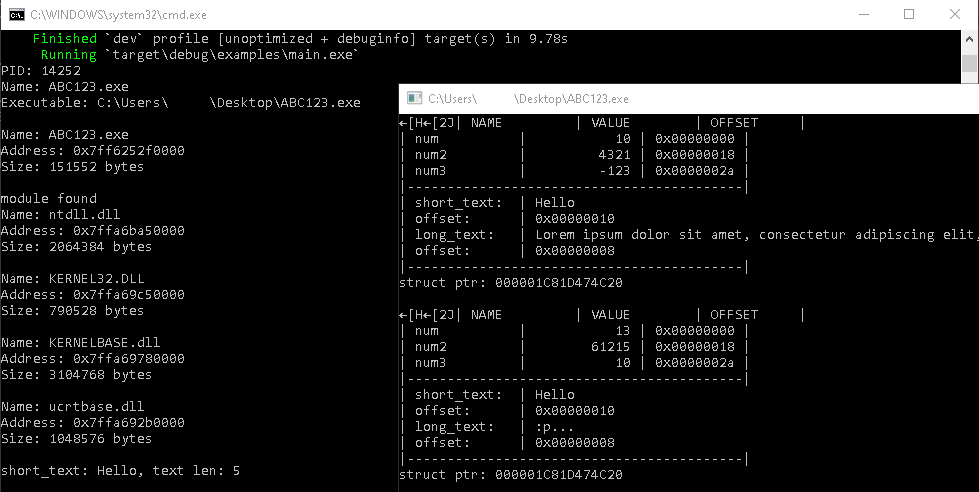

## Overview

`exbase` is a lightweight crate for inspecting and manipulating the memory of other processes.

## Usage

Make sure you have Rust installed. If not, run:

```
curl --proto '=https' --tlsv1.2 -sSf https://sh.rustup.rs | sh
```

### As a Rust Dependency

```toml
[dependencies]
my_crate = { git = "https://github.com/Loara228/exbase.git" }
```

### Building the Dynamic Library

```
git clone https://github.com/Loara228/exbase.git
cd exbase/src
cargo rustc --features=ffi --release --crate-type cdylib
```

## Examples

The demonstration program "[ABC123](./examples/c/target.c)" declares and initializes the pointer `my_struct_ptr`, which external processes can target to read and write the structure’s fields in memory.

```c

typedef struct {
    int             num;
    char*           long_text;
    char*           short_text;
    unsigned short  num2;
    char            padding[16];
    int8_t          num3;
} MyStruct;

MyStruct* my_struct_ptr = NULL;
```

In the infinite loop (waiting for Enter at each iteration), the program prints a formatted table of struct values and their offsets.

#### Running the demo application

```
cd build
./runtarget
```

### Rust

[Full example](./examples/rust/main.rs).

#### Launching the example

```
cd exbase/src
cargo run --example main
```

#### Fetching the process and its modules

```rs
use exbase::*;
```

```rs
let proc_info_list = get_process_info_list("ABC123").unwrap();
let proc_info = proc_info_list.into_iter().next().unwrap();

println!("PID: {}", proc_info.pid());
println!("Name: {}", proc_info.name());
println!("Executable: {}\n", proc_info.exe());

let modules = proc_info.get_modules().unwrap();
for r#mod in modules {
    println!("Name: {}", r#mod.name());
    println!("Address: 0x{:x}", r#mod.address());
    println!("Size: {} bytes\n", r#mod.size());
}
```

#### Memory

```rs
let mem = SysMem::new(proc_info.pid()).unwrap();
```

#### Pattern scan

Define the pattern to locate `my_struct_ptr`.

```rs
// mov    rax,QWORD PTR [rip+0x2a51]        # 0x403040 <my_struct_ptr>
// mov    eax,DWORD PTR [rax]
// mov    rdx,QWORD PTR [rbp-0x8]
let pat = Pattern::new("48 8b 05 ? ? ? ? 8b ?").unwrap();
```

Locate the memory segment containing `my_struct_ptr`, get its base address and size (see example above), then read its bytes and scan for the pattern.
Once we’ve found the pattern and calculated its offset from the base module, we can obtain a pointer to `my_struct_ptr`.

```rs
// 00400000-00401000 r-xp 00000000 00:23 1730705                            /path/to/ABC123
// 00403000-00404000 rw-p 00002000 00:23 1730705                            /path/to/ABC123
let mut buf = vec!(0u8; mod_size);
mem.read_buffer(&mut buf, mod_address);

let pattern_offset = pat.scan(&buf, false).into_iter().next().expect("not found");
let my_struct_ptr = relative_address(&mem, mod_address + pattern_offset, 3, 7);
```

#### Reading and writing

You can read/write scalar types by simply specifying their type. For more complex structs, use `repr(C)`

```rs
let value = mem.read::<i32>(addr + 0x18)
mem.write::<i32>(addr + 0x18, value)
```

Strings

```rs
let short_text: String = mem.read_string(addr, 256);
mem.write_buffer(b"hello world\0", addr);
```

Structures

```rs
#[repr(C)]
#[derive(Clone, Copy, Default)]
pub struct MyStruct {
    pub num: i32,
    pub long_text: usize,
    pub short_text: usize,
    pub num2: u16,
    pub _padding: [u8; 16],
    pub num3: i8,
}
```

```rs
let my_struct = mem.read::<MyStruct>(addr);
mem.write(addr, my_struct);
```

### Other languages

- **[C](./content/clang.md)**

### Pictures



